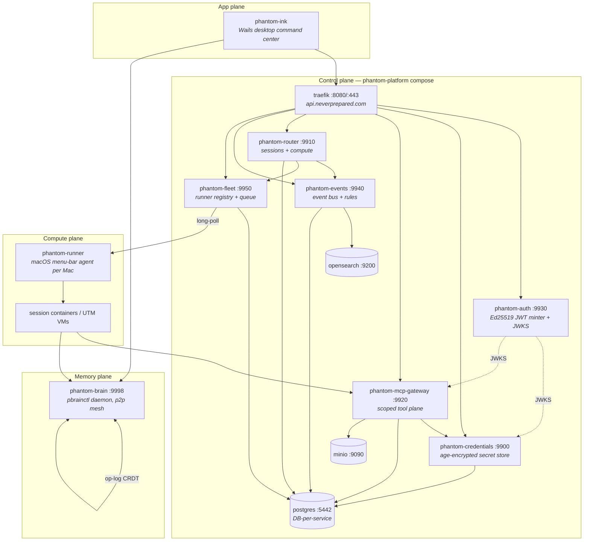
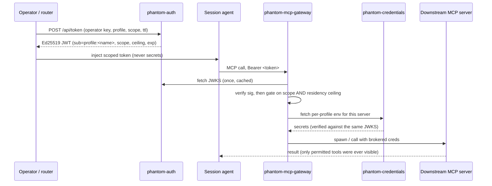

# Platform Architecture Overview

The canonical map of the phantom platform: what each service owns, how they compose, and
where the authoritative design decisions live.

**Scope.** This is a cross-repo map. `phantom-ink` (this repo) is one chapter of it — see
[App & compute plane](#app--compute-plane). The governing design document is
[`phantom-platform/docs/adr/ADR-000-platform-primitives.md`](../../phantom-platform/docs/adr/ADR-000-platform-primitives.md);
read it before any structural change.

**How to keep this doc honest.** Every port, path and env var below is taken from source
(`phantom-platform/docker-compose.yml`, each repo's own config), not from recollection.
When you change a boundary, change it here in the same PR.

---

## 1. The four planes

The system is an **identity-first decomposition** of an original monolith (`brainbox/`,
still in this repo as the production ancestor). Four planes, each with one owner:

| Plane | Owns | Primary repos |
|---|---|---|
| **Control** | Identity, credentials, tool brokering, sessions, events, runner placement | phantom-platform, phantom-auth, phantom-credentials, phantom-mcp-gateway, phantom-router, phantom-events, phantom-fleet |
| **Memory** | Durable multi-agent knowledge, skills, agent roles, todos | phantom-brain |
| **App** | Operator command center; authoring and triggering | phantom-ink |
| **Compute** | Executing work on real machines | phantom-runner |



### Host topology

Every Mac is multi-duty: a fleet runner, a brain mesh node, and — for one of them — the
platform host. Verified from the live fleet roster (`GET /api/runners`):

| Node | Address | Capabilities | Role |
|---|---|---|---|
| `m3-64` | 100.89.35.33 | docker, ollama | **Platform host** — runs the compose stack |
| `m5-128` | 100.99.226.22 | docker, utm, ollama | Runner + mesh node; the only UTM/macOS-VM host |
| `Local` | `local-process` | docker | In-process fallback; **excluded from placement** |

The roster is the source of truth, not this table — re-read it with
`curl -H "X-API-Key: $CL_API_KEY" https://api.neverprepared.com/api/runners`.

---

## 2. The trust chain

This is the spine of the platform. **A workspace profile is a service account.**



Properties worth preserving:

- **phantom-auth is the only holder of the private key.** It mints short-lived
  profile-scoped JWTs: `sub=profile:<name>`, with `scope`, a residency `ceiling`, and
  `kid = sha256(raw_pub)[:16]`. Revocation is expiry — there is no revocation list.
- **credentials and gateway are pure verifiers.** They fetch JWKS once, never call back,
  and keep no shared session store. That is what lets any of them move hosts.
- **An agent's reach is bounded twice:** by `scope` (tool patterns `<server>__<tool>`) and
  by `ceiling` (trust zones **LOCAL < INFRA < VENDOR < PUBLIC**; a downstream server whose
  derived zone exceeds the ceiling is *invisible*, not merely denied). Unclassifiable
  resolves to PUBLIC as the fail-safe.
- **Session containers hold a scoped token, never secrets.** Per-profile env is brokered
  at spawn time.
- **Claude in sessions runs under OAuth, no API keys.** This is an explicit invariant, not
  a default.
- **Cross-profile leakage is a bug.** A caller must never be able to *name* another
  tenant's resource; the write path derives the key from verified identity and the read
  path validates it (ADR-000 P2).

---

## 3. Control plane

`phantom-platform` is orchestration glue only — no application code. It builds each image
from its sibling repo and runs them port/DB/config-isolated. Compose + Traefik v3.6 +
Ansible, with `scripts/bootstrap.sh` for one-shot bring-up.

**Traefik** on `:8080` (+`:443` websecure, dashboard on `127.0.0.1:8090`) routes by path
prefix, declared as labels on each service:

| Route | Service | Port | Build context |
|---|---|---|---|
| `/auth/*` | auth | 9930 | `../phantom-auth` |
| `/credentials/*` | credentials | 9900 | `../phantom-credentials` |
| `/router/*` | router | 9910 | `../phantom-router` |
| `/gateway/*` (MCP at `/gateway/mcp`) | gateway | 9920 | `../phantom-mcp-gateway` |
| `/events/*` | events | 9940 | `../phantom-events` |
| `/fleet/*` | fleet | 9950 | `../phantom-fleet` |

Supporting infrastructure in the same stack:

| Service | Port | Image |
|---|---|---|
| postgres | 5442→5432 | `pgvector/pgvector:pg17` |
| minio | 9090 (S3), 9001 (console) | `minio/minio` |
| opensearch | `127.0.0.1:9200` | `opensearchproject/opensearch:2` |
| opensearch-dashboards | 5601 | `opensearchproject/opensearch-dashboards:2` |
| data-prepper | 21890 / 21891 / 21892 (OTLP traces / metrics / logs) | `opensearchproject/data-prepper:2` |

Plus init sidecars `postgres-init`, `minio-init`, `dashboards-init`. A Traefik *file*
provider additionally fronts NexusTower at `nexus.neverprepared.com`.

**DB-per-service** on the single Postgres: `phantom_credentials`, `phantom_router`,
`phantom_gateway`, `phantom_events`, `phantom_fleet`. Two registries:
`ghcr.io/neverprepared` (base images) and `registry.neverprepared.com`
(`brainbox-profile:<profile>`).

> **Operational note.** Router redeploy is **manual** — `git pull --ff-only` then
> `docker compose up -d --build router`. There is no CI on this path.

### Who owns what inside the control plane

**phantom-router** (`:9910`) owns sessions and compute: a 5-phase lifecycle
(`provision → configure → start → monitor → recycle`), the Docker / UTM / SSH backends,
the multi-agent hub and conversations, loops, and a Svelte dashboard. Python + FastAPI,
~161 routes, Postgres via psycopg3 with no SQLite fallback. Config is pydantic-settings,
env prefix `CL_`, nested `__`. Its CLI: `provision`, `run`, `recycle`, `api`, `stop`,
`status`, `restart`, `mcp`, `job`.

Three responsibilities have been cut out from under it:

- **phantom-events** (`:9940`) owns the log. The router emits `AgentEnvelope` lifecycle
  events via `HttpEventSink`/`CL_EVENTS_URL`; its own rules consumer is **off**
  (`CL_RULES__ENABLED=false`); events runs the rules consumer and dispatches matched
  targets *back* to the router's `/api/rules/dispatch`. The read path followed the writes,
  so the router now proxies `/api/agent_state` and `/api/agent_events` to the bus and
  relays its SSE. Dependency order is deliberately acyclic: events depends only on
  postgres; the router waits for events.
- **phantom-fleet** (`:9950`) owns the runner roster, health, pools, placement (`select`),
  the work queue, and pairing. Placement picks runners that advertise the backend, have
  heartbeat inside `FL_ONLINE_WINDOW_MS`, are under `max_concurrent`, and are not
  `local-process` — ordered by headroom, queue depth, tag overlap, then name.
- **phantom-loops** was extracted as a pure library with zero host coupling.

Two caveats that matter operationally:

> **The router's session dispatch has not cut over to phantom-fleet yet.** Fleet owns the
> model, but rewiring the router's core dispatch needs real-runner validation.

> **Fleet's work queue, results store and pairing tickets are in-memory** and do not
> survive a restart. Only the roster and pools are persisted (restored runners report
> `last_seen=0` → offline until their next heartbeat). `POST /api/runners/pair/claim` is
> the one unauthenticated route — the one-time token *is* the proof.

---

## 4. Memory plane — phantom-brain

One Go binary, `pbrainctl`, subsuming the agent-side MCP server, the HTTP daemon, and the
operator CLI. Build with `make` (needs CGO and the `sqlite_fts5` tag) — never bare
`go build`.

**Two processes:**

- **Daemon** (`pbrainctl server serve`) — the canonical store. Records land in a
  per-profile Postgres System of Record with pgvector embeddings; a transactional outbox +
  River worker projects each record into the OpenSearch `pb_records` index; attachment
  blobs go to MinIO. An async synth worker runs the gate and distill.
- **Client** (`pbrainctl client mcp`) — a per-session stdio MCP server. Every read and
  write goes to the daemon over HTTP. Reads are online and always fresh; writes pass
  through a per-binding write-ahead queue so they survive a daemon outage and drain on
  reconnect.

**Lifecycle:** ingest (`learn` / `perceive` / `attach`) → **gate** (score source
reliability, classify subject topic) → **synthesize** (distill to prose, extract entities,
re-project) → **recall** (hybrid BM25 + kNN, with automatic fallback to a direct
pgvector/FTS query on the SoR if OpenSearch is unavailable).

### The vault model

This is the part most often got wrong:

- **A vault is not an enum.** It is a filesystem-discovered bearer-token binding.
  `Registry.Load` (`internal/server/registry.go`) walks
  `profiles/<profile>/vaults/<vault>/` at startup and on SIGHUP
  (`pbrainctl server vault reload`). Vault names are arbitrary.
- **A profile is one Postgres database** `pb_<profile>`, shared by all of that profile's
  vaults; `vault` is simply a query-scoping column. One daemon serves every
  profile/vault pair. Document IDs are `<profile>:<vault>:<sha>`.
- **The client selects its vault purely by which bearer token it sends.** Auth is
  `Authorization: Bearer` — **not** `X-API-Key`, a recurring source of confusion.
- **Synth vs verbatim.** By default a write passes the LLM gate and is distilled (the body
  is rewritten). Verbatim records survive byte-for-byte. Verbatim is keyed on record
  `Kind` and wired in **three** places — `internal/osearch/docs.go`,
  `verbatimKindForVault()` in `internal/server/handlers_write.go`, and a
  `records_kind_chk` migration. So adding a *verbatim* vault is a Go + migration change;
  adding a normal one is just `pbrainctl server profile create`.

| Vault | Mode | Holds |
|---|---|---|
| `memory` | synth | Long-term knowledge: gated, distilled, hybrid-searchable |
| `skills` | verbatim | Curated skill documents (`kind=skill`) |
| `agents` | verbatim | Agent role definitions (`kind=agent`) |
| `todo` | verbatim | Open work items (`kind=todo`) |

Verbatim exists precisely so the skills/agents/todo layer can live *in* the brain as an
exact content store rather than as paraphrased knowledge.

**Mesh sync.** Leaderless p2p op-log CRDT (`internal/nodesync`), gated by
`PB_SYNC_ENABLED=1`. Peers are listed in `CL_SYNC__PEERS` with **one entry per
(peer × profile × vault)** — a new synced vault is not free. `GET /admin/mesh/status`
reports per-peer liveness and lag, and feeds the app's Brain Mesh panel. Record
versioning is `supersede` via `record_links`; there is no git-based backup path.

> **Known config drift.** `phantom-platform/config/phantom-brain/profiles/` still
> provisions `artifacts` and `sessions` for all three profiles, though neither is part of
> the model above, and the `agents` vault is **absent from that config** even though it is
> live on the daemon and populated — so a fresh bootstrap from the repo would not recreate
> it. The drift is confined to that config: `phantom-router`'s `config.py` is already
> correct, listing `["memory", "skills", "todo", "agents"]` and documenting `artifacts`
> and `sessions` as retired.

**How vault tokens reach a session** (relevant whenever a vault is added): the router
derives one env var per vault from `CL_BRAIN__VAULTS` — the default vault as
`CL_BRAIN_API_TOKEN`, each other as `CL_<VAULT>_API_TOKEN` — in `lifecycle.py`. Tokens stay
**server-side**; the profile image injects them. So the router half of adding a vault is
declarative. The brain half (creating the binding, `auth.toml`, and DB provisioning) is
separate, and is where the drift above comes from.

---

## 5. Skills & agents

**Agent = role (WHO / WHY / WHEN). Skill = capability (HOW).** They compose; they are not
substitutes. Agents stay few and thin, skills many and shared. The test for where
something belongs: *would any other agent want this?* → make it a skill.

Both live as records in the brain, per profile — **not** as files in `~/.claude/skills`:

| Surface | Vault / source | Read path |
|---|---|---|
| Curated skills | `skills` vault, `kind=skill` | `phantom-skills` router skill → `pbrainctl client` |
| Claude Code agent roles | `agents` vault, `kind=agent` | `phantom-agents` router skill; app's Brain Mesh tab (`app/app_agent_vault.go`) |
| Todos | `todo` vault, `kind=todo` | `phantom-todo` router skill |
| Long-term memory | `memory` vault | `phantom-memory` router skill |

Only four thin **router skills** remain on disk, each a `pbrainctl client` wrapper
following the same shape: `list` (catalog) → `recall` (fuzzy) → `show <name>` (full
document). There is no per-skill native auto-trigger; the router skill is the entry point.

> **Naming trap.** Claude Code reserves built-in slash names (`/memory`, `/skills`), and a
> colliding skill is **silently skipped**. Hence the mandatory `phantom-` prefix.

### Two different things are called "agents"

Do not conflate these:

- **Brain `agents` vault roles** — Claude Code subagent personas loaded on demand by the
  `phantom-agents` skill (currently e.g. `researcher`, `trend-scout`, `task-planner`).
- **Router session agents** — the roles a container session runs as, defined in
  `phantom-router`'s `agents/roles/*.md`. Six role files exist, but only four currently
  register and appear in `prouterctl agents` (`assistant`, `reviewer`, `supervisor`,
  `worker`); `merge-queue` and `pr-shepherd` are present on disk but dormant.

---

## 6. App & compute plane

### phantom-ink (this repo)

A Wails 2 macOS desktop app — the operator command center. The whole `App` struct is bound
to the frontend, so **one exported method on `*App` in an `app_<feature>.go` file is the
API surface**. Local state is SQLite at `~/.phantom-ink.db`, with schema changes going
through `app/db_migrations.go`.

| Surface | Count | Notes |
|---|---|---|
| Svelte panels | 24 files | Only **11** are sidebar-routed (6 `workspace`, 5 `system`); the other 13 are nested tabs. Registry: `app/frontend/src/lib/panels.ts` |
| `app_*.go` features | 39 | One file per Wails-bound feature surface |
| brainbox modules | 67 | `brainbox/src/brainbox/*.py` |

Two label-only renames keep their internal ids so deep links, shortcuts and stored state
keep working: Jobs → **"Automations"** (id stays `jobs`), Code → **"Work"** (id stays
`code`).

> **Direction of travel (ADR-001).** The app's role is deliberately narrowing to an
> **authoring surface and trigger source**. It is to stop being a parallel orchestration
> runtime; orchestration belongs to the router.

`brainbox/` in this repo is the pre-decomposition ancestor of phantom-router and still
runs as the production orchestrator. `shell-profiler/` is the Go CLI managing the
direnv-backed workspace profiles that everything else is scoped by.

### The contract loop

One JSON Schema — the `AgentEnvelope` / timeline-entry — is the single source of truth for
both the event bus and collection-script output. It travels a full cycle:

```
brainbox AgentEnvelope (pydantic, agent_store.py)
  → brainbox/scripts/export_contract.py
  → pushed by phantom-ink CI to phantom-contracts, tagged timeline-entry/v2.1
  → consumed back via app/internal/contract/CONTRACT_TAG + `just app-contract-gen`
```

Hand-editing either end reintroduces exactly the drift phantom-contracts exists to
prevent. `contracts/` in this repo holds **only** the array framing (6 lines) over the
item schema. The gate is CI: `.github/workflows/contract-freshness.yml` fails on drift, and
a re-run of `just app-contract-gen` must produce no diff. Bus producers and consumers must
additionally follow `docs/event-bus-conformance.md`, enforced by
`app/app_conformance_test.go`.

### Three MCP surfaces — do not conflate

1. **`brainbox mcp`** — the operator-facing MCP server over the REST API.
2. **`brainbox-mcp`** (`packages/brainbox-mcp/`) — the trimmed *guest* variant installed
   *into* session containers.
3. **The MCP gateway** — the security boundary (section 2). Decision rule from ADR-000:
   a server belongs in the gateway iff **all** of — external API, stateless,
   container-launchable, creds worth brokering. Otherwise it is session-side. The gateway
   **never** gets `docker.sock`; container lifecycle lives with the router.

### phantom-runner

The compute edge: a macOS **menu-bar app** (`LSUIElement`, Swift/SwiftUI, one per Mac)
that connects *outward* and long-polls for work, then drives Docker, UTM or Ollama on the
host. No server component and no MCP server.

It advertises `docker`, `utm`, and `secret_authority` — the laptop holds the credentials
and must seal them, which means **if the laptop is offline, no sessions start anywhere.
That is by design**, not a bug.

---

## 7. Decomposition status

| State | Components | Note |
|---|---|---|
| **Live core** | phantom-ink, phantom-brain, phantom-router, phantom-mindwalk, phantom-platform | Active weekly development |
| **Stable & finished** | phantom-auth, phantom-credentials, phantom-mcp-gateway, phantom-events, phantom-contracts, prouterctl | Small surfaces, cutovers complete. **Low commit counts here mean *done*, not abandoned** — do not delete them |
| **In progress** | phantom-fleet (router dispatch not cut over), phantom-runner (credential-cache rollout) | See caveats in §3 |
| **Stalled** | phantom-loops | Extracted as a zero-coupling library; later stages never landed. The router keeps re-export shims plus an `advance` endpoint and a `loop.advance` rule target, ready for the day it becomes a service |

Adjacent but **not part of this platform**: `phantom-finance` is an unrelated trading
desktop app that shares only the naming prefix.

**Do not use — retired, superseded, or archival:** `reflex`, `phantom-skills`,
`phantom-skills-registry`, `phantom-voice`, `phantom-ink-p2p`,
`phantom-ink-pre-migration`, the `artifacts` and `sessions` vaults, playbooks, Qdrant, the
`standalone-brain` compose profile, and the phantom-brain MCP vault servers (superseded by
`pbrainctl client`).

---

## 8. ADR index

ADRs live in **two** repos. Five documents exist.

| # | Repo | Title | Status |
|---|---|---|---|
| [000](../../phantom-platform/docs/adr/ADR-000-platform-primitives.md) | phantom-platform | Platform Architecture Primitives & Contracts | Living reference |
| [001](architecture/ADR-001-agent-orchestration.md) | phantom-ink | A2A Façade + Per-Step Model Router; Defer LangGraph | Accepted 2026-06-28 |
| [002](architecture/ADR-002-mcp-gateway.md) | phantom-ink | Shared MCP Gateway (per-profile, token-scoped) | Accepted; phases 1–3 landed |
| [003](../../phantom-platform/docs/adr/ADR-003-integrations-operator-placed-services.md) | phantom-platform | Integrations — operator-placed services on the fleet | Proposed |
| **004** | — | *Does not exist* | **Gap** — referenced only from inside ADR-005 |
| [005](../../phantom-platform/docs/adr/ADR-005-session-capability-scoping.md) | phantom-platform | Session Capability Scoping — role → tools | Draft 2026-08-16 |

> **Known mis-reference.** Several places in this repo cite "ADR-003" as though it were
> local — `app/app_integrations.go`, `app/brainbox/integrations.go`, and the Jira design
> spec. There is no ADR-003 in phantom-ink; the document is phantom-platform's, linked
> above.

### What ADR-000 actually governs

Two meta-rules bind every design decision:

- **Compose, don't re-own.** A component integrates another via its API/contract and never
  absorbs the other's internals (schema, config, storage, creds). This is what keeps the
  decomposition decomposed.
- **Contracts, not frameworks.** Name a primitive when a *third real instance* appears.
  Write thin interfaces and checklists; do not build engines for single instances.

It also defines the **lifecycle taxonomy** — every runtime thing is exactly one of
always-on infra (compose), per-agent ephemeral (router), per-profile resource
(provisioning), or shared on-demand capability (scale-to-zero) — and seven primitives.

> **Only P1 (Seam), P2 (identity-derived isolation) and the taxonomy are *earned*.** A
> 2026-07-29 adversarial review found P3–P7 were named for designs that never shipped and
> explicitly demoted them to candidate patterns pending a third shipped instance. Treat
> them as such: the shipped data plane is well-isolated, and the risk sits in unbuilt
> control-plane machinery.

### Further design reading

- `docs/architecture/ORCHESTRATION.md` — the current host→container orchestration flow,
  the tmux-injection query sequence, and the container lifecycle state machine.
- `docs/profile-container-flow.md` — how a workspace profile's env, SSH and git identity
  reach a sandboxed container.
- `docs/event-bus-conformance.md` — the four hard rules for bus producers and consumers.
- `phantom-brain/docs/design/` — OpenSearch-native memory architecture, daemon cutover,
  memory-graph fork.
