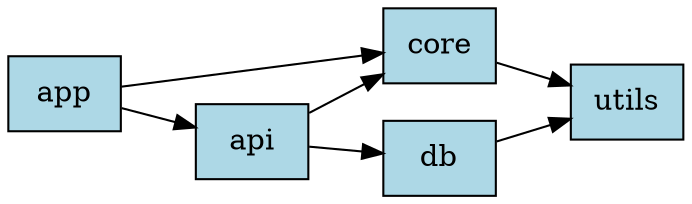
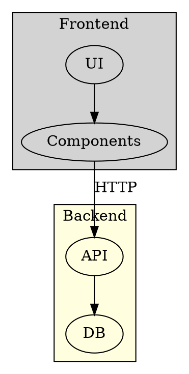

# Architecture Diagrams

Show how systems are composed — services, containers, infrastructure, dependencies.

**Recommended:** D2 for clean modern architecture docs. Structurizr or C4-PlantUML for formal C4 model. Graphviz for complex dependency/call graphs needing precise layout.

## In Obsidian (obsidian-kroki)

Use a fenced code block with the type as language identifier — renders inline automatically.

## D2 — `d2`

Best for: modern architecture docs, SQL tables, readable source. SVG only.

```d2
frontend: {
    app: React App
    nginx: Nginx
}

backend: {
    api: FastAPI
    auth: Auth Service
    db: PostgreSQL {shape: cylinder}
    cache: Redis {shape: hexagon}
}

frontend.app -> backend.api: HTTPS
backend.api -> backend.auth: validate
backend.api -> backend.db: SQL
backend.api -> backend.cache: GET/SET
```

SQL tables:
```d2
users: {
    shape: sql_table
    id: int {constraint: primary_key}
    email: varchar(255) {constraint: unique}
}
orders: {
    shape: sql_table
    id: int {constraint: primary_key}
    user_id: int {constraint: foreign_key}
}
users.id -> orders.user_id
```

Connections: `->` directed · `<->` bidirectional · `--` undirected  
Styling: `fill`, `stroke`, `border-radius`, `bold`, `animated`

## C4-PlantUML — `c4plantuml`

Best for: C4 model diagrams (Context, Container, Component, Dynamic, Deployment). Standard C4 visual style.

```plantuml
@startuml
!include C4_Container.puml

Person(user, "User", "End user")

System_Boundary(platform, "Platform") {
    Container(spa, "SPA", "React", "Customer UI")
    Container(api, "API", "FastAPI", "REST backend")
    ContainerDb(db, "Database", "PostgreSQL", "Primary store")
}

System_Ext(email, "Email Service", "Sends notifications")

Rel(user, spa, "Uses", "HTTPS")
Rel(spa, api, "Calls", "REST/JSON")
Rel(api, db, "Reads/writes", "SQL")
Rel(api, email, "Sends via", "SMTP")

SHOW_LEGEND()
@enduml
```

Includes: `C4_Context.puml` · `C4_Container.puml` · `C4_Component.puml` · `C4_Dynamic.puml` · `C4_Deployment.puml`

Macros: `Person`, `System`, `System_Ext`, `Container`, `ContainerDb`, `ContainerQueue`, `Component`, `Rel`, `Rel_Back`, `BiRel`

## Structurizr — `structurizr`

Best for: defining the full C4 model once and generating multiple views from a single workspace.

```
workspace "Platform" {
    model {
        user = person "User"
        platform = softwareSystem "Platform" {
            spa = container "SPA" "React UI" "React"
            api = container "API" "REST backend" "FastAPI"
            db  = container "Database" "Primary store" "PostgreSQL" {
                tags "Database"
            }
        }
        stripe = softwareSystem "Stripe" { tags "External" }

        user -> spa "Uses" "HTTPS"
        spa  -> api "Calls" "REST"
        api  -> db  "Reads/writes" "SQL"
        api  -> stripe "Charges" "HTTPS"
    }
    views {
        systemContext platform "Context" { include *; autoLayout lr }
        container platform "Containers" { include *; autoLayout tb }
        styles {
            element "Database" { shape Cylinder }
            element "External"  { background #999999; color #ffffff }
        }
    }
}
```

## Graphviz — `graphviz`

Best for: complex dependency graphs, call graphs, large multi-level graphs needing precise layout control.



Layout engines (set via `layout=`): `dot` (hierarchical, default) · `neato` (spring/undirected) · `fdp` (force-directed) · `circo` (circular) · `twopi` (radial)

Clusters:


## Choosing

| Need | Tool |
|------|------|
| Clean, readable architecture docs | D2 |
| Formal C4 model, one view at a time | C4-PlantUML |
| Full C4 model, multiple views from one spec | Structurizr |
| Complex dependency/call graphs | Graphviz |
