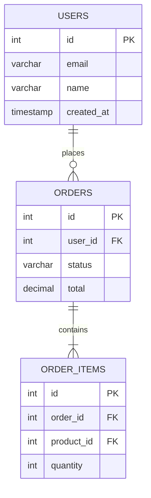

# Database Diagrams

Show database schemas, entity relationships, and data models.

**Recommended:** DBML for full schema with types and constraints. ERD for a quick entity overview. Mermaid erDiagram for inline markdown.

## In Obsidian (obsidian-kroki)

Use a fenced code block with the type as language identifier — renders inline automatically.

## DBML — `dbml`

Best for: complete schema documentation with column types, constraints, indexes, and foreign key actions.

```dbml
Table users {
  id       integer     [pk, increment]
  email    varchar(255)[unique, not null]
  name     varchar(100)[not null]
  role     varchar(20) [default: 'customer']
  created_at timestamp  [default: `now()`]

  indexes {
    email [name: 'idx_users_email']
  }
}

Enum order_status {
  pending
  processing
  shipped
  delivered
  cancelled
}

Table orders {
  id         integer      [pk, increment]
  user_id    integer      [not null, ref: > users.id]
  status     order_status [not null, default: 'pending']
  total      decimal(10,2)[not null]
  placed_at  timestamp    [default: `now()`]

  indexes {
    user_id
    (user_id, status) [unique]
  }
}

Table order_items {
  id         integer      [pk, increment]
  order_id   integer      [not null, ref: > orders.id]
  product_id integer      [not null, ref: > products.id]
  quantity   integer      [not null]
  unit_price decimal(10,2)[not null]
}

Table products {
  id    integer     [pk, increment]
  sku   varchar(50) [unique, not null]
  name  varchar(255)[not null]
  price decimal(10,2)[not null]
  stock integer     [not null, default: 0]
}

TableGroup commerce { orders; order_items; products }

Ref fk_order_user: orders.user_id > users.id [delete: cascade]
```

Key syntax:
- Column: `name type [settings]`
- Settings: `pk`, `increment`, `unique`, `not null`, `default: value`, `ref: > table.col`
- Ref directions: `>` many-to-one · `<` one-to-many · `-` one-to-one · `<>` many-to-many
- `TableGroup` groups tables visually

## ERD — `erd`

Best for: quick entity overview without types or constraints.

```
[Customer]
*id
name
+email

[Order]
*id
+customer_id
total
status

[Product]
*id
name
price

Customer 1--* Order [places]
Order *--* Product [contains]
```

Attribute prefixes: `*` primary key · `+` foreign key · (none) regular attribute  
Cardinality: `1--1` · `1--*` · `*--*` · `?--*` · `1--?`

## Mermaid erDiagram — `mermaid`

Best for: inline schema in GitHub/GitLab markdown or Obsidian notes (native renderer).



Cardinality: `||` one · `o|` zero-or-one · `}|` one-or-more · `}o` zero-or-more

## Choosing

| Need | Tool |
|------|------|
| Full schema (types, constraints, indexes, FK actions) | DBML |
| Quick entity-relationship overview, no types needed | ERD |
| Inline in markdown / GitHub / Obsidian native | Mermaid erDiagram |
