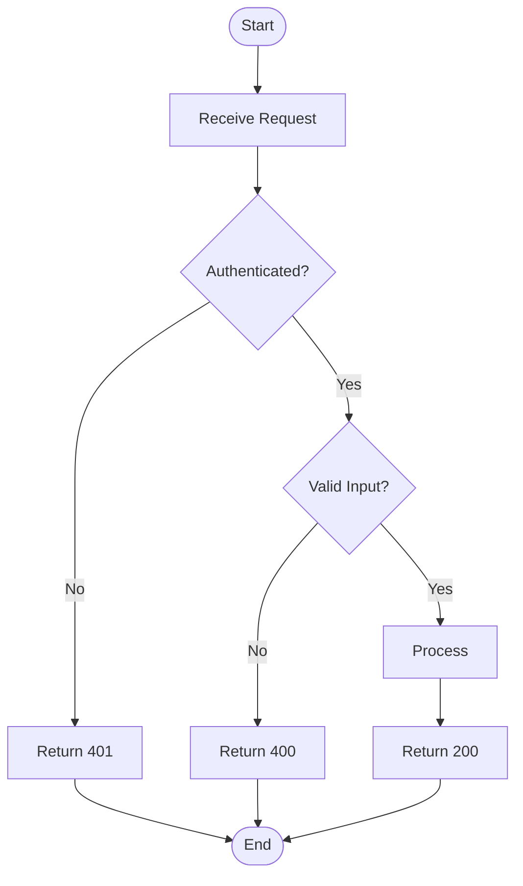
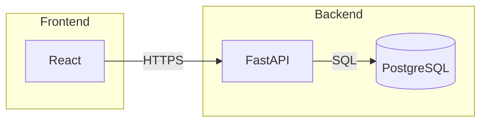
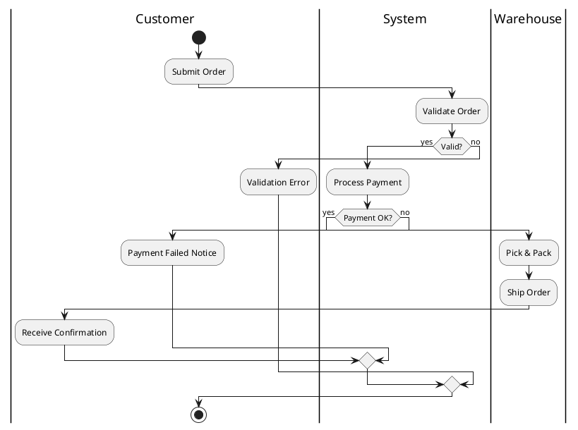

# Flowchart Diagrams

Show process flows, decision branches, and step-by-step workflows.

**Recommended:** Mermaid for most cases — simple syntax, renders natively in Obsidian and GitHub. PlantUML activity when you need swimlanes or complex branching. actdiag for minimal block-style flows.

## In Obsidian (obsidian-kroki)

Use a fenced code block with the type as language identifier — renders inline automatically. Mermaid also renders via Obsidian's native renderer.

## Mermaid — `mermaid`

Best for: quick flowcharts, decision trees, GitHub/GitLab inline rendering.



Direction: `TD` top-down · `LR` left-right · `BT` bottom-top · `RL`

Node shapes: `[rect]` · `(rounded)` · `{diamond}` · `((circle))` · `[(cylinder)]` · `/parallelogram/`

Subgraphs:


## PlantUML Activity — `plantuml`

Best for: swimlanes showing which actor performs each step, complex branching with fork/join.



Key syntax:
- `:Step name;` for activities
- `if (condition?) then (yes) ... else (no) ... endif`
- `fork ... fork again ... end fork` for parallel
- `|LaneName|` to switch swimlane
- `start` / `stop` / `end`

## actdiag — `actdiag` (companion required)

Best for: simple activity flows with lanes, minimal syntax.

```
actdiag {
  orientation = portrait;

  lane Customer {
    submit [label = "Submit Order"];
    confirm [label = "View Confirmation"];
  }
  lane System {
    validate [label = "Validate"];
    charge   [label = "Charge Card"];
    notify   [label = "Send Email"];
  }
  lane Warehouse {
    pick [label = "Pick Items"];
    ship [label = "Ship"];
  }

  submit -> validate -> charge -> pick -> ship -> notify -> confirm;
}
```

Node shapes: `box` (default) · `roundedBox` · `diamond` · `beginpoint` · `endpoint`

## Choosing

| Need | Tool |
|------|------|
| Most flowcharts | Mermaid |
| Swimlanes, complex branching, fork/join | PlantUML activity |
| Minimal syntax, blockdiag-family style | actdiag |
