# Mermaid Diagrams

Mermaid is markdown-native and renders in GitHub, GitLab, Notion, and VS Code. Text-first, easy to read and diff.

## Rendering

```
convert_diagram("mermaid", source, "svg")
```

Supported formats: `svg`, `png`. **Requires companion container** — Kroki must be running with the mermaid companion.

## Flowcharts

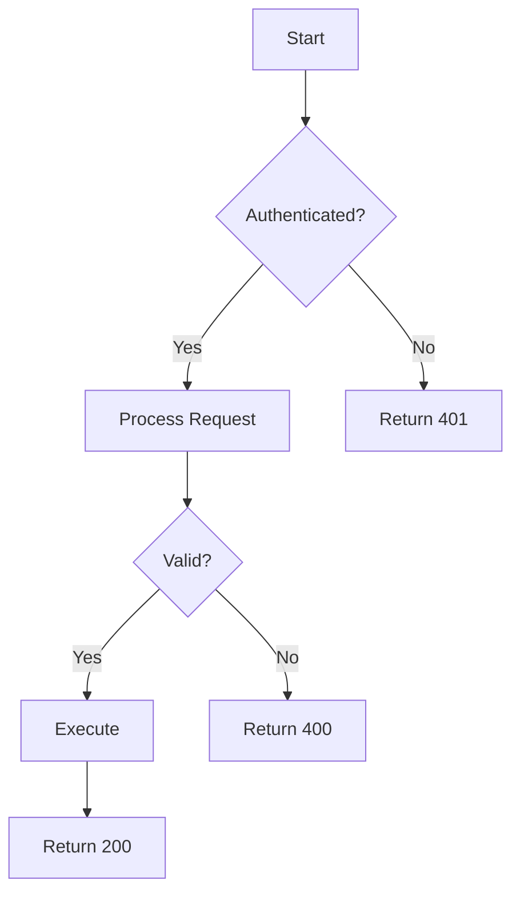

Direction: `TD` (top-down), `LR` (left-right), `BT` (bottom-top), `RL`

Node shapes:
| Syntax | Shape |
|--------|-------|
| `[text]` | Rectangle |
| `(text)` | Rounded |
| `{text}` | Diamond (decision) |
| `((text))` | Circle |
| `>text]` | Asymmetric |
| `[[text]]` | Subroutine |
| `[(text)]` | Cylinder (DB) |
| `/text/` | Parallelogram |

Subgraphs:
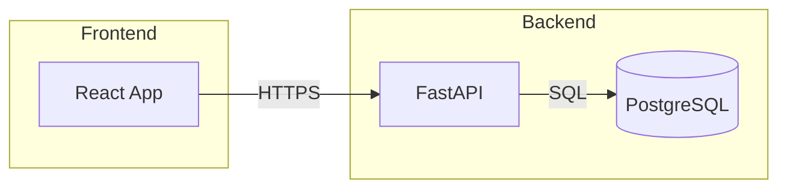

## Sequence Diagrams

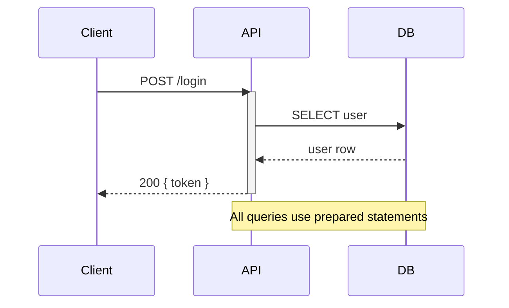

Arrow types:
| Syntax | Style |
|--------|-------|
| `->>` | Solid, open arrowhead |
| `-->>` | Dashed, open arrowhead |
| `->` | Solid, closed |
| `-->` | Dashed, closed |
| `-x` | Solid, X end |
| `--x` | Dashed, X end |

Loops, conditions, and parallel:
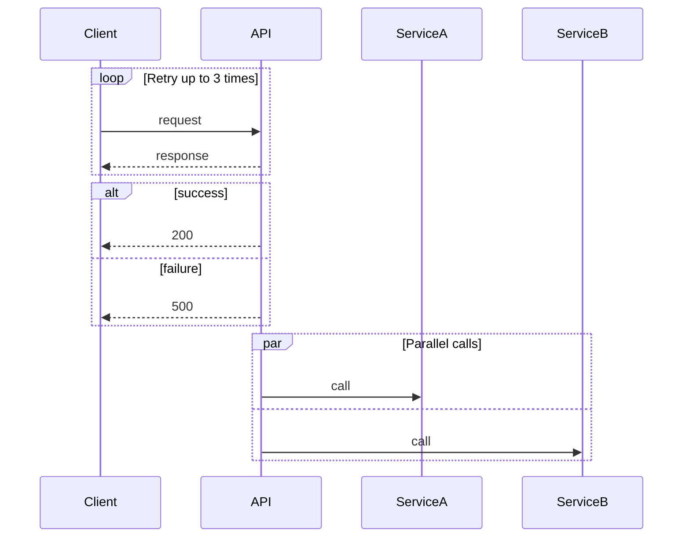

## Class Diagrams

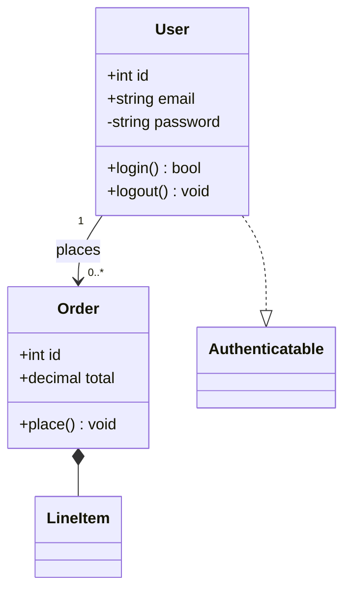

Relationships:
| Syntax | Meaning |
|--------|---------|
| `<\|--` | Inheritance |
| `..\|>` | Implementation |
| `*--` | Composition |
| `o--` | Aggregation |
| `-->` | Association |
| `..>` | Dependency |

## Entity-Relationship Diagrams

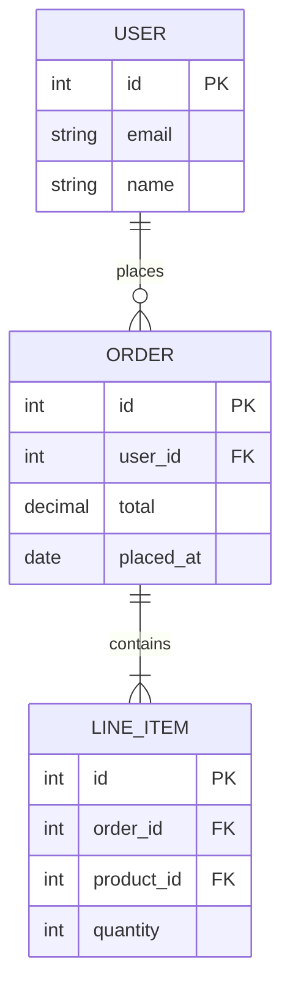

Cardinality: `||` (one), `o|` (zero or one), `}|` (one or more), `}o` (zero or more)

## State Diagrams

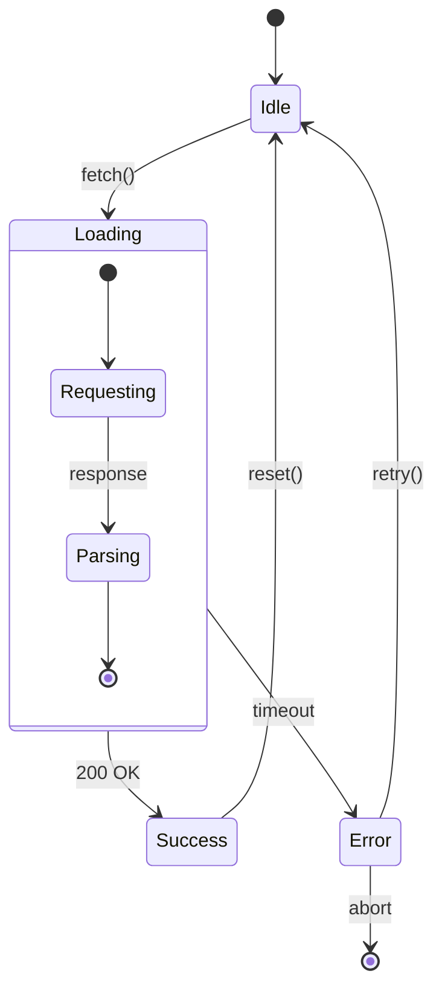

## Gantt Charts

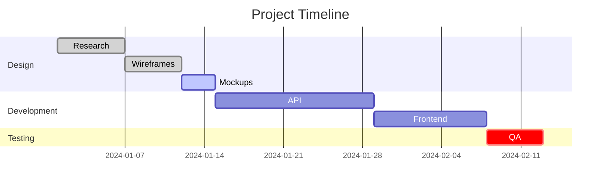

## Git Graphs

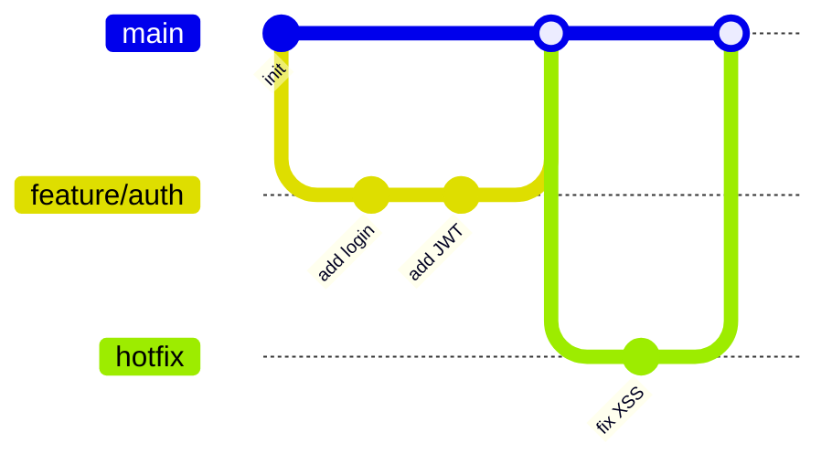

## Mindmaps

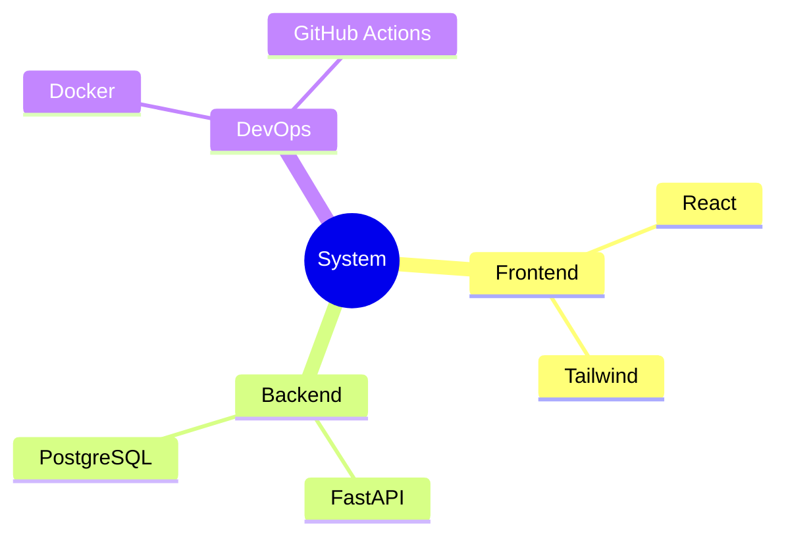

## Timeline

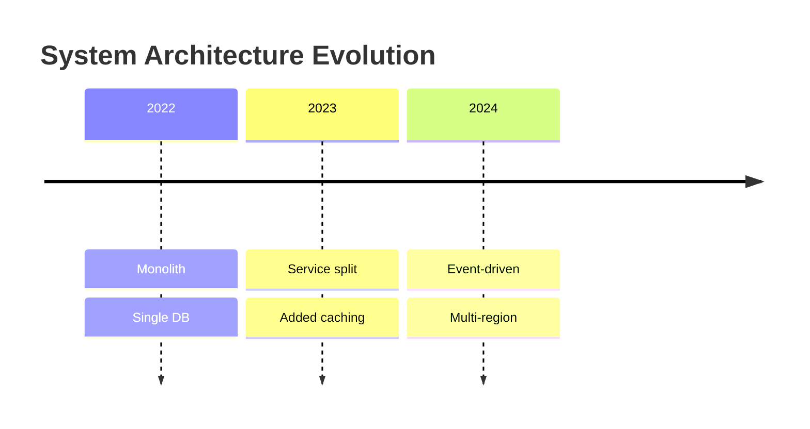

## Pie Charts

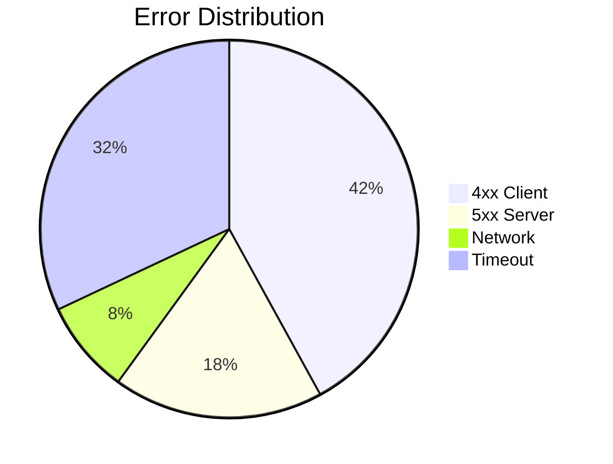

## Styling

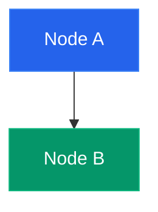

Themes (set in config block):
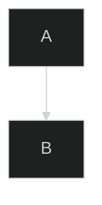

Available themes: `default`, `dark`, `forest`, `neutral`, `base`

## When to Use Mermaid vs Alternatives

| Need | Use |
|------|-----|
| GitHub/GitLab inline rendering | Mermaid |
| Complex layout control | Graphviz |
| Full UML (sequence with activation) | PlantUML |
| Modern architecture docs | D2 |
| Database schema | DBML or ERD type |
| Renders without companion | PlantUML, D2, Graphviz |

## See Also
- `kroki-diagrams` skill — all types, routing, companion requirements
- `plantuml` skill — full UML alternative
- `image-to-diagram` skill — convert images to Mermaid/DOT
