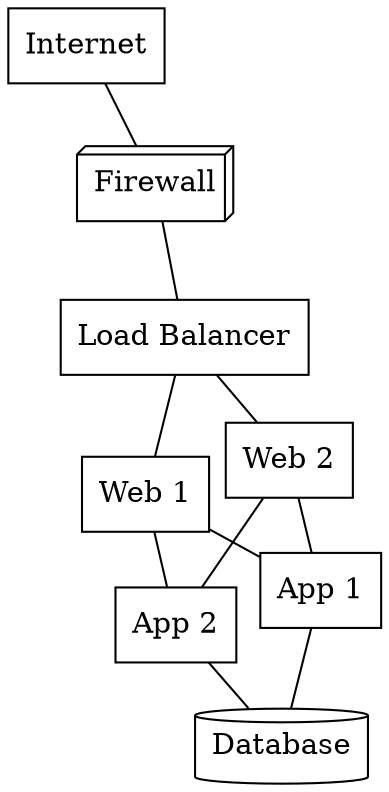

# Network Diagrams

Show physical and logical network topology, infrastructure layout, and server racks.

**Recommended:** nwdiag for IP network segments with host assignments. Graphviz for flexible topology graphs. rackdiag for physical rack layout.

## In Obsidian (obsidian-kroki)

Use a fenced code block with the type as language identifier — renders inline automatically.

## nwdiag — `nwdiag` (companion required)

Best for: network diagrams showing servers grouped into network segments with IP addresses. Multi-homed hosts appear in each segment automatically.

```
nwdiag {
  network internet {
    address = "0.0.0.0/0";
    cf [label = "CloudFront", shape = "cloud"];
  }

  network public {
    address = "10.0.1.0/24";
    cf  [address = "10.0.1.1"];
    alb [address = "10.0.1.10", label = "Load Balancer"];
  }

  network app {
    address = "10.0.2.0/24";
    alb   [address = "10.0.2.1"];
    web01 [address = "10.0.2.10", label = "App Server 1", color = "lightblue"];
    web02 [address = "10.0.2.11", label = "App Server 2", color = "lightblue"];
  }

  network db {
    address = "10.0.3.0/24";
    web01   [address = "10.0.3.1"];
    web02   [address = "10.0.3.2"];
    primary [address = "10.0.3.10", label = "RDS Primary", color = "lightyellow"];
    replica [address = "10.0.3.11", label = "RDS Replica", color = "lightyellow"];
  }
}
```

- Nodes listed in multiple networks render as multi-homed (connected to each network bar)
- `address` on a network is display-only label; `address` on a node shows under the hostname

## Graphviz — `graphviz`

Best for: flexible network topology, call graphs, dependency maps — anywhere you need graph layout control.



Layout engines: `dot` (hierarchical) · `neato` (spring, good for undirected networks) · `fdp` (force-directed) · `circo` (circular) · `twopi` (radial)

Node shapes: `box` · `ellipse` · `circle` · `cylinder` (database) · `box3d` · `cloud`

## rackdiag — `rackdiag` (companion required)

Best for: physical rack layout — servers, switches, patch panels by rack unit.

```
rackdiag {
  rack {
    description = "Server Rack A";
    units = 20;

    1U; "Patch Panel";
    1U; "24-Port Switch"  [color = "lightgreen"];
    1U; "Firewall"        [color = "pink"];
    4U; "App Server 1"    [color = "lightblue"];
    4U; "App Server 2"    [color = "lightblue"];
    2U; "1U Gap";
    8U; "SAN Array"       [color = "lightyellow"];
  }

  rack {
    description = "Network Rack";
    units = 12;

    2U; "Core Switch"     [color = "lightgreen"];
    1U; "VPN Gateway";
    1U; "OOB Management";
    2U; "UPS Module";
  }
}
```

- Format: `<units>U; "Label" [attributes];`
- Multiple racks render side-by-side
- `units = N` sets total rack height; equipment beyond this overflows

## Choosing

| Need | Tool |
|------|------|
| IP network segments with host addresses | nwdiag |
| Flexible topology / dependency graph | Graphviz |
| Physical server rack layout | rackdiag |
