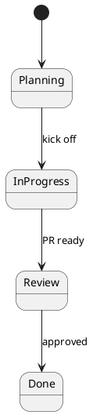

# Obsidian Project Skill

Manage time-bound projects in the second brain. Projects auto-link to related research and archive in place when complete.

## Commands

| Usage | Action |
|-------|--------|
| `/project Deploy app to EKS by May 15` | Create a new project with deadline |
| `/project list` | Show active projects with deadlines |
| `/project complete <id>` | Mark a project as done (archives in place) |

## Creating a Project

Parse the user's input to extract the title and deadline, then create the project:

```
Tool: mcp__obsidian-memory__memory_project
Arguments:
  action: "create"
  title: "<project title>"
  deadline: "YYYY-MM-DD"
  content: "<goals, context, deliverables>"
  tags: ["<relevant-topic-tags>"]
```

### Important: Use topic tags for auto-linking

The tags you set on the project determine which existing research memories auto-link to it. Choose tags that match your existing knowledge base.

**Examples:**
- Project "Deploy to EKS" → tags: `["project", "aws", "eks", "kubernetes", "containers"]`
- Project "Migrate to Azure" → tags: `["project", "azure", "aks", "containers", "networking"]`
- Project "Build monitoring dashboard" → tags: `["project", "observability", "prometheus", "grafana"]`

This creates bidirectional `[[wiki-links]]` between the project and all existing memories sharing 2+ tags. In the Obsidian graph, the project node will cluster with its related research.

### Extracting deadlines from natural language

| User says | Deadline |
|-----------|----------|
| "by May 15" | 2026-05-15 |
| "end of Q2" | 2026-06-30 |
| "next Friday" | Calculate from today |
| "in 2 weeks" | Calculate from today |
| No deadline mentioned | Ask: "What's the deadline for this?" |

Always convert to absolute `YYYY-MM-DD` format.

## Listing Projects

```
Tool: mcp__obsidian-memory__memory_project
Arguments:
  action: "list"
```

Shows all active (non-archived) projects sorted by deadline. Flags overdue and stale projects.

## Completing a Project

```
Tool: mcp__obsidian-memory__memory_project
Arguments:
  action: "complete"
  id: "<project_memory_id>"
```

This:
- Sets `status: archived` on the project memory
- Appends a completion date to the content
- **Does NOT move the file** — it stays in `Projects/` to preserve graph links
- Related research in `Resources/` remains active and linked

## Project-Aware Research

When doing research with `/obsidian-research` while a project is active:

1. **Check for active projects** first:
   ```
   Tool: mcp__obsidian-memory__memory_project
   Arguments:
     action: "list"
   ```

2. If the research topic matches an active project's tags, the new research memory will **auto-link to the project** via shared tags (handled by `memory_store` automatically).

3. No manual linking needed — the tag overlap creates the graph connections.

## PARA Category Usage

| Category | What goes there | Lifecycle |
|----------|----------------|-----------|
| **projects** | Active work with deadlines | Created → auto-links research → completed (archived in place) |
| **resources** | Reference material, research | Persists, linked to projects via tags |
| **areas** | Ongoing responsibilities, role context | Persists, rarely changes |

### Projects vs Resources

- **"Deploy to EKS by May 15"** → `projects` (has deadline, has deliverable)
- **"AWS EKS Key Concepts"** → `resources` (reference material, no deadline)
- The project *links to* the resource. When the project completes, the resource stays active.

### When to use Areas

Store area memories for persistent role/team context:
- "Our team uses Terraform for all infra"
- "Production deploys happen Tue/Thu only"
- "Always use us-east-1 for new services"

```
Tool: mcp__obsidian-memory__memory_store
Arguments:
  title: "Team Infrastructure Standards"
  content: "..."
  para: "areas"
  tags: ["team", "standards", "infrastructure"]
  ttl_days: 365
```

## Diagrams in Project Notes

With the [obsidian-kroki](https://github.com/gregzuro/obsidian-kroki) plugin installed, project notes can embed any Kroki diagram type as a fenced code block — it renders inline automatically. The language identifier is the Kroki type name.

```d2
frontend: Frontend
backend: Backend
db: Database {shape: cylinder}

frontend -> backend: HTTPS
backend -> db: SQL
```



Useful types for project notes:
- **Architecture**: `d2`, `plantuml`, `c4plantuml`, `structurizr`
- **Timeline / gantt**: `mermaid` (native Obsidian renderer)
- **Database schema**: `dbml`, `erd`
- **Sequence / flow**: `plantuml`, `seqdiag`

Note: `plantuml` and `mermaid` are disabled by default in obsidian-kroki — enable them in plugin settings, or use Obsidian's native mermaid renderer. Refer to the individual diagram type skills for syntax.

## Example: Full Project Lifecycle

```
User: "I need to deploy our app to EKS by May 15"

1. Create project:
   memory_project(action: "create", title: "Deploy app to EKS",
     deadline: "2026-05-15", tags: ["aws", "eks", "kubernetes", "containers"])
   → Creates project, auto-links to existing EKS/AWS research

2. User researches during project:
   /obsidian-research "EKS networking best practices"
   → Finds cached "AWS VPC" and "EKS Key Concepts" memories
   → Stores new findings → auto-links to project via shared tags

3. Project completes:
   User: "the EKS deploy is done"
   memory_project(action: "complete", id: "mem_xxx_deploy-app-to-eks")
   → Status set to archived, completion date added
   → File stays in Projects/, all graph links preserved
   → Research memories remain active for future projects
```
