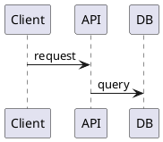
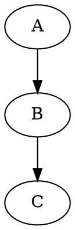

# Obsidian Research Skill

Research workflow that checks Obsidian memory first, falls back to web search only when needed, and stores new findings for future recall.

## Workflow

```
1. Search Obsidian memory  → mcp__obsidian-second-brain__memory_search
2. Evaluate coverage       → Sufficient & fresh? Use cached. Gaps or stale? Continue.
3. Recall full content     → mcp__obsidian-second-brain__memory_recall (for relevant hits)
4. Web search fallback     → WebSearch / WebFetch (only for gaps)
5. Store new findings      → mcp__obsidian-second-brain__memory_store
6. Update stale memories   → mcp__obsidian-second-brain__memory_update
7. Respond with merged     → Combine cached + new, cite sources
```

## Step 1: Search Obsidian Memory

Always search memory first with the user's topic:

```
Tool: mcp__obsidian-second-brain__memory_search
Arguments:
  query: "<user's question or topic keywords>"
  freshness: "fresh"
  limit: 10
```

Also check for stale results that may need refreshing:

```
Tool: mcp__obsidian-second-brain__memory_search
Arguments:
  query: "<same query>"
  freshness: "stale"
  limit: 5
```

Run both searches in parallel.

## Step 2: Evaluate Coverage

Use this matrix to decide the next action:

| Fresh Results | Stale Results | Action |
|---------------|---------------|--------|
| >= 3 with score >= 5 | Any | **Use cached** — recall full content, skip web search |
| 1-2 with score >= 5 | Any | **Partial** — recall cached, web search for gaps only |
| 0 | >= 1 | **Refresh** — web search, then update stale memories |
| 0 | 0 | **Full search** — web search everything, store all results |

## Step 3: Recall Full Content

For each relevant fresh result, get the full content:

```
Tool: mcp__obsidian-second-brain__memory_recall
Arguments:
  id: "<memory_id from search results>"
```

Read the freshness and source_urls fields. If the memory is marked STALE in the recall output, flag it for refresh even if it was returned as a match.

## Step 4: Web Search Fallback

Only search the web for information NOT covered by fresh memories:

```
Tool: WebSearch
Query: "<refined query targeting specific gaps>"
```

For detailed page content:

```
Tool: WebFetch
URL: "<specific documentation URL>"
Prompt: "<what to extract>"
```

When formulating web queries, exclude topics already covered by fresh cached results.

## Step 5: Store New Findings

Store synthesized web research as new memories:

```
Tool: mcp__obsidian-second-brain__memory_store
Arguments:
  title: "<Descriptive Title - Topic & Scope>"
  content: "<synthesized findings in markdown>"
  para: "resources"
  tags: ["<topic>", "<subtopic>", ...]
  source: "import"
  source_urls: ["https://...", "https://..."]
  ttl_days: <see TTL guidelines below>
  confidence: "medium" or "high"
```

## Step 6: Update Stale Memories

When stale memories exist on the same topic, update them instead of creating duplicates:

```
Tool: mcp__obsidian-second-brain__memory_update
Arguments:
  id: "<stale_memory_id>"
  content: "<refreshed content>"
  source_urls: ["<new sources>", "<plus original sources worth keeping>"]
```

The `updated` timestamp resets automatically, which resets the TTL clock.

## Step 7: Respond

Combine cached and new information. In your response:
- Lead with the answer, not the process
- Note if information came from cached memory vs fresh web search
- Include source URLs at the end

## TTL Guidelines

| Topic Type | ttl_days | Rationale |
|------------|----------|-----------|
| Cloud service docs (AWS, Azure) | 90 | APIs and features change quarterly |
| Architecture patterns | 180 | Relatively stable |
| Programming language features | 120 | Major releases ~yearly |
| Historical facts / demographics | 365 | Changes slowly |
| News / current events | 7 | Ephemeral |
| Security advisories | 30 | Critical to stay current |
| Personal notes / preferences | 365 | Stable |

## PARA Category Selection

| Content Type | PARA Category |
|-------------|---------------|
| General reference / knowledge | `resources` |
| Active project research | `resources` (link to project via `related`) |
| Ongoing responsibility docs | `areas` |
| Time-bound deliverable notes | `projects` |

Most research output goes to `resources`. Use tags and `related` links to connect to projects rather than storing research in `projects`.

## Best Practices

- **Don't duplicate**: Before storing, check if a memory with similar title/tags already exists. Update it instead.
- **Tag consistently**: Use lowercase, hyphenated tags matching the topic taxonomy (e.g., `aws`, `azure`, `containers`, `networking`).
- **Preserve source URLs**: When updating stale memories, merge new source_urls with existing ones rather than replacing.
- **Confidence levels**: Use `high` only for official documentation and well-sourced data. Use `medium` for synthesized research. Use `low` for unverified or single-source information.
- **Chunk large topics**: Rather than one massive memory, split into focused memories that link to each other via `related` slugs.

## Long-Form Output (Library Pattern)

For substantial synthesized research that won't fit comfortably in a single retrievable atom, use the vault's `Library/` folder. It lives outside PARA, is **not indexed by `memory_search`**, and exists for human-readable long-form docs.

Subfolders: `HowTos/`, `Runbooks/`, `Articles/`, `References/`, `Scratch/`.

Pattern:
1. Write the long-form doc to `Library/Articles/<slug>.md` (or `Runbooks/`, etc.) — human-managed via Obsidian.
2. Store a short atom in `resources` whose body references the doc via `[[Library/Articles/<slug>]]`. The atom is what future searches find; the wiki-link points to the expansion.

There are no MCP tools that write into `Library/` — surface the long-form content in your reply so the user or parent can place it.

## Activity Lookups

For "what did I research on topic X recently?" or date-bounded coverage questions, prefer `mcp__obsidian-second-brain__memory_timeline` over `memory_search`:

```
Tool: mcp__obsidian-second-brain__memory_timeline
Arguments:
  after: "<ISO date>"
  para: "resources"        # optional
  tags: ["<topic>"]        # optional
  group_by: "day" | "week" | "none"
  activity: "updated"      # or "created" / "accessed"
  limit: 30
```

Returns a chronological view of memory atoms — no retrieval roundtrip, no scoring.

## Diagrams in Vault Notes

With the [obsidian-kroki](https://github.com/gregzuro/obsidian-kroki) plugin installed, any fenced code block whose language identifier matches a Kroki diagram type is rendered inline automatically — no pre-rendering or MCP call needed.



```d2
frontend -> backend: HTTPS
backend -> db: SQL
```



The language identifier is the Kroki type name exactly: `plantuml`, `d2`, `graphviz`, `mermaid`, `c4plantuml`, `structurizr`, `dbml`, `erd`, `nomnoml`, `ditaa`, `svgbob`, `wavedrom`, `bytefield`, `vega`, `vegalite`, `bpmn`, `excalidraw`, `blockdiag`, `seqdiag`, `actdiag`, `nwdiag`, `packetdiag`, `rackdiag`, `diagramsnet`, `pikchr`, `symbolator`, `umlet`.

**Important defaults:**
- `mermaid` is **disabled by default** in obsidian-kroki (conflicts with Obsidian's native renderer) — use Obsidian's native mermaid block or enable it explicitly in plugin settings
- `plantuml` is also disabled by default — enable in plugin settings if needed

**File inclusion:** load diagram source from a vault file instead of inlining it:
````
```plantuml
@from_file:diagrams/my-diagram.puml
```
````

**Choose the right type for the content:**

| Content | Diagram type |
|---------|-------------|
| Architecture / C4 | `plantuml`, `c4plantuml`, `structurizr`, `d2` |
| Database schema | `dbml`, `erd` |
| Sequence / flow | `plantuml`, `seqdiag`, `mermaid` |
| Network topology | `nwdiag`, `graphviz` |
| Data visualization | `vegalite`, `vega` |
| Protocol / packets | `bytefield`, `wavedrom` |
| Quick sketch | `nomnoml`, `svgbob`, `ditaa` |

The `phantom-diagrams` MCP (`convert_diagram`) is still useful for rendering diagrams *outside* of Obsidian (in chat, CI pipelines, etc.). Refer to the individual diagram type skills for syntax.

## Integration

- **Supersedes**: the previous `web-research` skill (deleted) — this is the canonical research workflow now
- **Hybrid retrieval**: `memory_search` runs sqlite-vec KNN + FTS5 BM25 against `{vault}/_index/vectors.db` and fuses the rankings — handles both conceptual queries and exact-term recall
- **Depends on**: `mcp__obsidian-second-brain__*` tools with freshness fields (last_accessed, source_urls, ttl_days)
