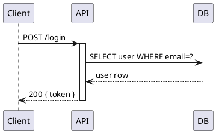
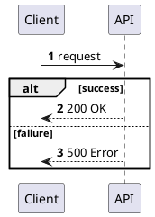
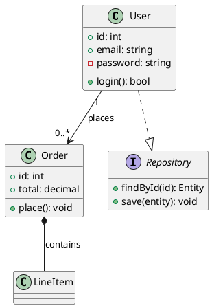
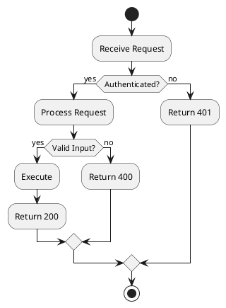
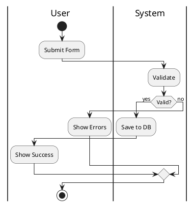
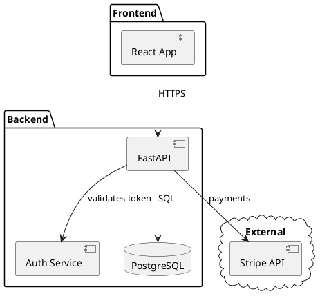
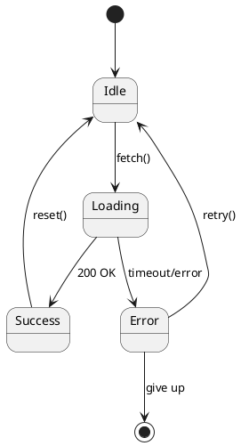
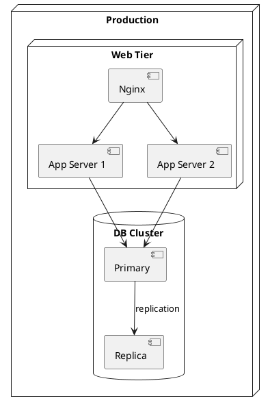

# PlantUML

PlantUML covers the full UML spectrum plus C4 architecture. All diagrams are wrapped in `@startuml` / `@enduml`.

## Rendering

```
convert_diagram("plantuml", source, "svg")   # standard UML
convert_diagram("c4plantuml", source, "svg") # C4 model diagrams
```

Supported formats: `svg`, `png`, `jpeg`. No companion container required.

## Sequence Diagrams



Key syntax:
- `->` synchronous call, `-->` return
- `->>`  async (open arrowhead)
- `activate` / `deactivate` show lifeline boxes
- `alt`/`else`/`end` for conditionals
- `loop N times` for loops
- `group Label` for grouping
- `note left/right of Participant: text`
- `autonumber` to number messages



## Class Diagrams



Relationships:
| Symbol | Meaning |
|--------|---------|
| `<|--` | Inheritance (extends) |
| `..|>` | Implementation (implements) |
| `*--`  | Composition |
| `o--`  | Aggregation |
| `-->`  | Association |
| `..>`  | Dependency |

## Activity / Flowchart



New (beta) syntax with swimlanes:


## Component Diagrams



## State Diagrams



## Deployment Diagrams



## C4 Model (c4plantuml type)

```plantuml
@startuml
!include C4_Context.puml

Person(user, "User", "An end user")
System(system, "My System", "Does things")
System_Ext(ext, "External API", "Third party")

Rel(user, system, "Uses", "HTTPS")
Rel(system, ext, "Calls", "REST")
@enduml
```

Available includes:
- `C4_Context.puml` — System Context
- `C4_Container.puml` — Containers
- `C4_Component.puml` — Components
- `C4_Dynamic.puml` — Dynamic diagrams
- `C4_Deployment.puml` — Deployment

Use `convert_diagram("c4plantuml", source, "svg")` for C4 diagrams.

## Styling

```plantuml
@startuml
skinparam backgroundColor white
skinparam sequenceArrowThickness 2
skinparam roundcorner 5
skinparam componentStyle rectangle

skinparam component {
    BackgroundColor LightBlue
    BorderColor DarkBlue
    FontColor Black
}

!theme plain
@enduml
```

Common themes: `plain`, `amiga`, `aws-orange`, `blueprint`, `cerulean`, `hacker`, `sketchy`

## Useful Shortcuts

```plantuml
' Comments start with single quote
title My Diagram Title
header Left Header
footer Page %page% of %lastpage%

' Grouping in sequence
box "Internal Services" #LightBlue
    participant API
    participant DB
end box

' Notes
note over API,DB: Encrypted channel
note left: side note
```

## See Also
- `kroki-diagrams` skill — type routing, format table, other tools
- `graphviz-diagrams` skill — when you need precise layout control
