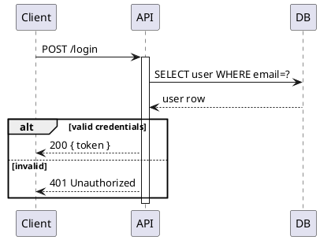
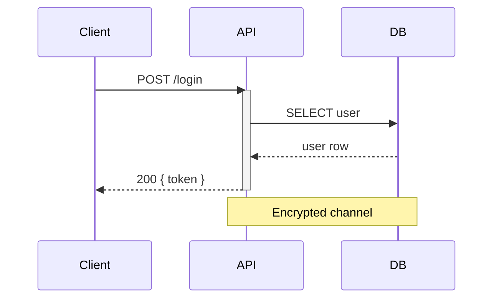
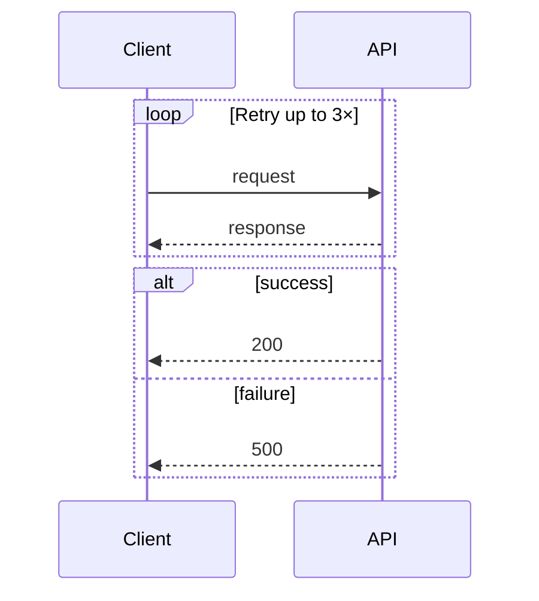

# Sequence Diagrams

Show message flows between participants over time — API calls, auth flows, protocol exchanges.

**Recommended:** PlantUML for complex flows (activation boxes, alt/loop/par). Mermaid for simple flows in markdown. seqdiag for minimal diagrams.

## In Obsidian (obsidian-kroki)

Use a fenced code block with the diagram type as language identifier — renders inline automatically.

## PlantUML — `plantuml`

Best for: activation boxes, conditionals, parallel flows, grouping.



Key syntax:
- `->` call, `-->` return, `->>` async
- `activate` / `deactivate` show lifeline boxes
- `alt`/`else`/`end` for conditionals, `loop`, `par` for parallel
- `autonumber` to number messages
- `note over A,B: text` for annotations
- `box "Label" #color ... end box` to group participants

## Mermaid — `mermaid`

Best for: simple flows, markdown documents, GitHub rendering. Native in Obsidian (no obsidian-kroki needed for mermaid).



Arrow types: `->>` (solid open), `-->>` (dashed open), `->` (solid closed), `-->` (dashed closed), `-x` (lost)

Loops and conditions:


## seqdiag — `seqdiag` (companion required)

Best for: dead-simple sequence diagrams with minimal syntax.

```
seqdiag {
  Browser -> API [label = "POST /login"];
  API -> DB     [label = "SELECT user"];
  API <- DB     [label = "user row"];
  Browser <- API [label = "200 { token }"];
}
```

Separators: `=== Phase Label ===` · Notes: `... note text ...`

## Choosing

| Need | Tool |
|------|------|
| Activation boxes, alt/loop/par | PlantUML |
| Inline in GitHub/GitLab markdown | Mermaid |
| Minimal syntax, no extras | seqdiag |
