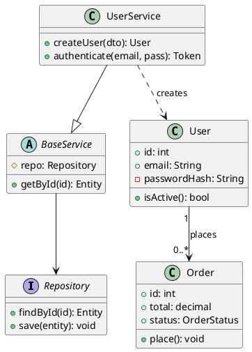
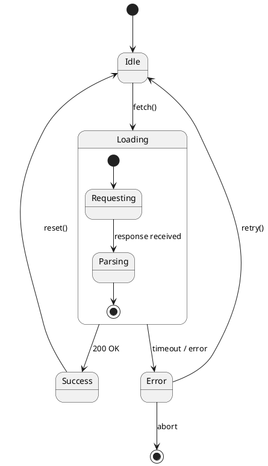
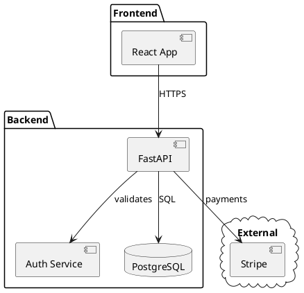
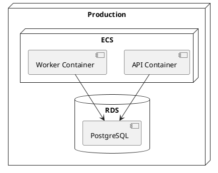
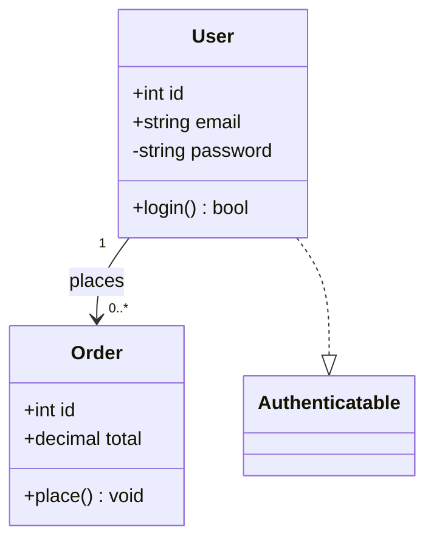
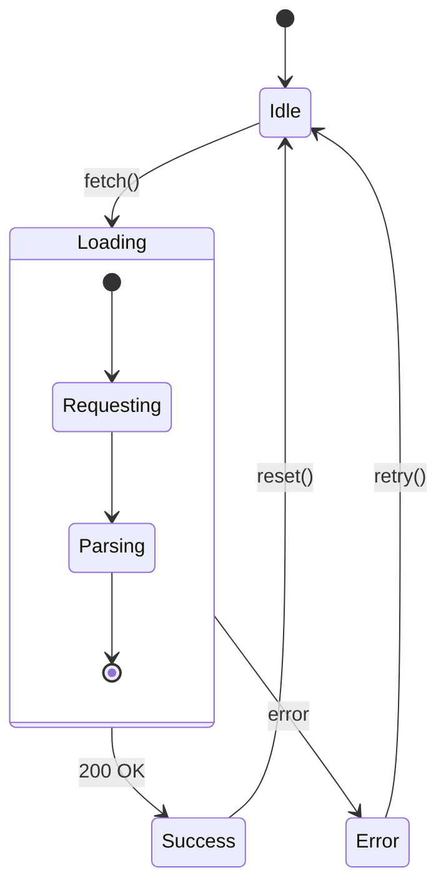

# UML Diagrams

Formal object-oriented diagrams — class hierarchies, state machines, component structure, deployment.

**Recommended:** PlantUML for full UML compliance. Mermaid for class/state diagrams in markdown. nomnoml for quick lightweight sketches.

## In Obsidian (obsidian-kroki)

Use a fenced code block with the type as language identifier — renders inline automatically.

## PlantUML — `plantuml`

### Class Diagrams



Relationships:
| Symbol | Meaning |
|--------|---------|
| `<\|--` | Inheritance |
| `..\|>` | Implementation |
| `*--` | Composition |
| `o--` | Aggregation |
| `-->` | Association |
| `..>` | Dependency |

### State Diagrams



### Component Diagrams



### Deployment Diagrams



## Mermaid — `mermaid`

### Class Diagram



### State Diagram



## nomnoml — `nomnoml`

Best for: quick UML-like sketches with minimal syntax, no XML.

```
#direction: right

[<interface> Repository|
  findById(id)
  save(entity)
]

[UserService|
  -repo: Repository
  |
  createUser()
  authenticate()
]

[<frame> Domain|
  [User|
    -id: int
    -email: string
    |
    +isActive()
  ]
  [Order|
    -id: int
    -total: decimal
    |
    +place()
  ]
  [User] -> [Order]
]

[UserService] -> [Repository]
[UserService] -:> [Repository]
```

Shapes: `[Name]` box · `[<abstract>]` · `[<interface>]` · `[<frame>]` group · `[<database>]` · `[<actor>]`  
Relations: `->` association · `-->` dependency · `-:>` realization · `->*` composition · `->+` aggregation

## Choosing

| Need | Tool |
|------|------|
| Full UML spec (class, state, component, deployment) | PlantUML |
| Class or state diagrams in markdown / GitHub | Mermaid |
| Quick sketch, minimal syntax | nomnoml |
